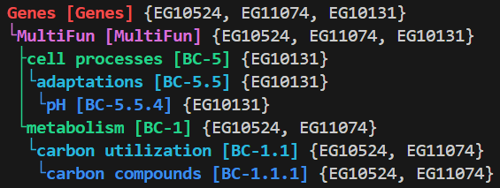

# Setup

```console
python -m pip install ontologize
```

# Usage

## Vignette: Genes

Suppose we have a list of genes, perhaps ones that are upregulated in a certain environment, and we wish to understand the functional changes in the cell.

We can first build an `Ontology` object from a list of the genes' BioCyc IDs:

```python
from ontologize.ontology import build_ontology

# cadA EG10131
# lacA EG10524 
# xylA EG11074 
ont = build_ontology(objects=["EG10131", "EG10524", "EG11074"], schema_type="Gene")
```

`Ontology` objects store an annotated ontology graph, as a networkX DiGraph:

```python
import networkx as nx
assert isinstance(ont.graph, nx.DiGraph)
```

Rich printing options are supported, including truncation of the graph at a given depth, inclusion/exclusion of leaf nodes, whether to color by depth.

```python
print(ont.to_string(max_depth=None, include_leaves=False, colors=True))
```

<!--  -->


In this example, we see that lacA and xylA are both involved in carbon utilization, while cadA is related to pH adaptation.

## Command-Line Interface

Once exposed, `ontologize` exposes a runnable script, and can also be called as a module:

```console
ontologize <file> <schema_type> [flags]
python -m ontologize <file> <schema_type> [flags]
```

The required arguments are given as follows:

- `file`: Path to a `.csv`, `.tsv`, or `.xlsx` file with BioCyc object IDs to ontologize. By default, assumes a (header-less, if `.csv` or `.tsv`) first column containing the IDs to be ontologized. If a `.xlsx` file is given, then by default, IDs are assumed to be in the first sheet in the first column, treating the first entry as a header.

- `schema_type` : Type of the objects (or properties) to be ontologized in the [Biocyc Schema](https://biocyc.org/schema.shtml). For example, this might be `Gene`, `Pathway`, `Compound`, etc. 

> Note that `schema_type` uses the singular form of the class name!

### Example:

```python
# TODO
```

### Flags

Ontology-building options:
- `-s <sheet_name>, --sheet <sheet_name>`: For a `.xlsx` file, the name of the sheet containing BioCyc IDs. Ignored if `file` is not a `.xlsx` file.
- `-o <objects>, --objects <objects>`: For a multi-column `file`, the name of the column containing BioCyc IDs for the objects to ontologize. Requires a header row containing column names.
- `-p <objects>, --property <objects>`: For a multi-column `file`, the name of the column containing BioCyc IDs for the property to ontologize. Requires a header row containing column names. When using this option, the objects must also be specified using the `-o` option. 
- > **WARNING: `-p, --property` NOT YET IMPLEMENTED**
- `--database <orgid>`: BioCyc organism ID, used to specify the organism-specific database within to search. [ECOLI](https://ecocyc.org/) by default.

Printing options:
- `--depth <depth>`: Maximum depth of the ontology to print. No limit by default.
- `--leaves`: Whether to show leaf nodes, i.e., the ontologized objects themselves. Not shown by default.
- `--coloroff`: Turns off colorful printing.

> TODO: graph options (not implemented), pkl options, --interactive (allows maintaining session)


# References

[BioCyc19] Karp, P.D., et al., The BioCyc collection of microbial genomes and metabolic pathways
Briefings in Bioinformatics (2019).